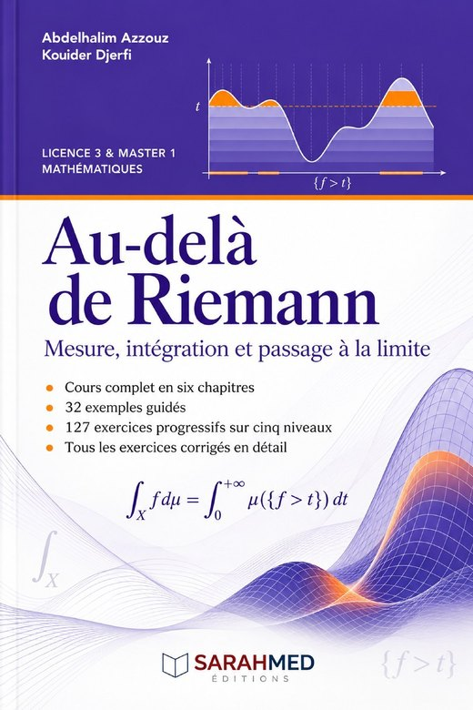

This section provides course notes, problem sheets, and other teaching resources.

## Course notes

### Mathematical Logic (Licence 2)

:::: {.columns}
::: {.column width="30%"}
[{.course-cover}](files/logique-mathematique-L2-extrait.pdf)
:::
::: {.column width="70%"}
*From language to proof.* Lecture notes with tutorial exercises for second-year Licence students in Mathematics. Four chapters: mathematical language and reasoning; set theory; propositional calculus and predicate calculus; well-ordering and induction. Academic year 2026–2027. Unpublished.

[Cover, contents, chapter 1 and references (PDF)](files/logique-mathematique-L2-extrait.pdf){.btn .btn-primary}
:::
::::

### Measure and Integration

:::: {.columns}
::: {.column width="30%"}
[{.course-cover}](files/au-dela-de-riemann-extrait.pdf)
:::
::: {.column width="70%"}
*Au-delà de Riemann : Mesure, intégration et passage à la limite.* Abdelhalim Azzouz and Kouider Djerfi. SARAHMED Éditions, 2026.

A course for Licence 3 and Master 1, in six chapters: $\sigma$-algebras and measures; measurable functions and random variables; integrable functions and the Lebesgue integral; product measures and iterated integrals; $L^p$ spaces; density, convolution and the Hilbert space $L^2$.

[Cover, contents and references (PDF)](files/au-dela-de-riemann-extrait.pdf){.btn .btn-primary}
:::
::::

### Differential Calculus

Resources on differential calculus, multivariable integration, differential forms, Green–Stokes formulas, and submanifolds.

### Descriptive Statistics

Teaching materials and exercises for descriptive statistics.

::: {.callout-tip}
PDF files can be placed in the `files/` directory and linked directly from this page. Large or archival documents can instead point to the university repository or Zenodo.
:::
